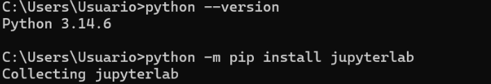
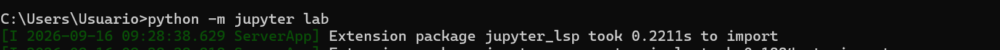
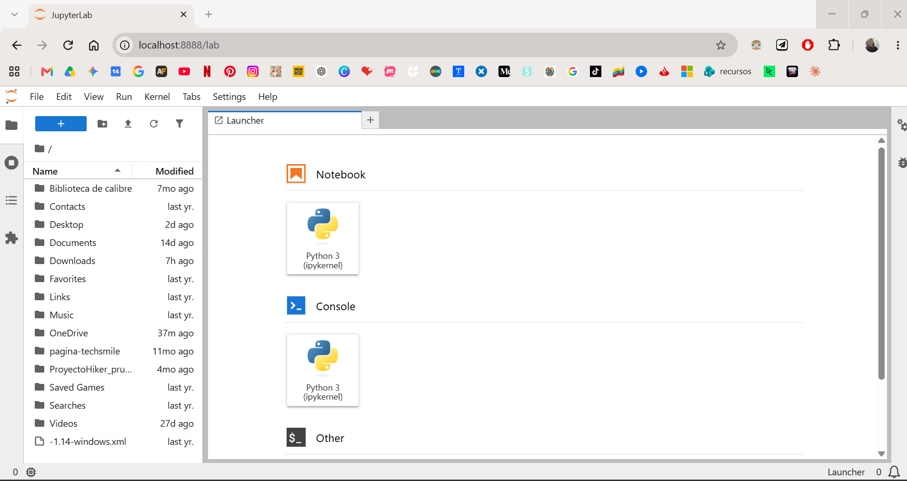
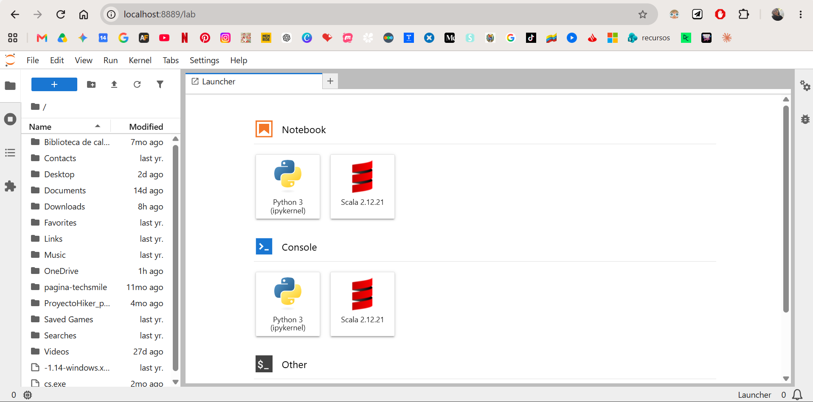
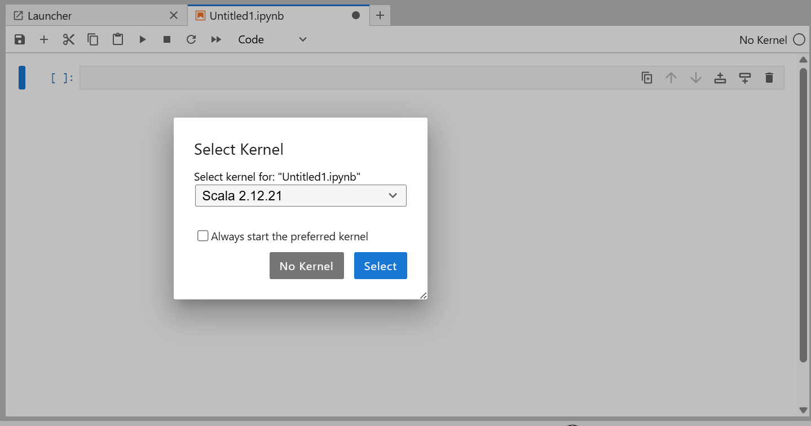
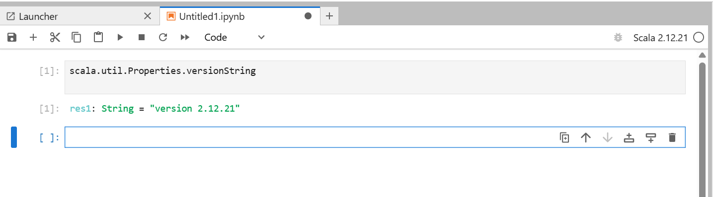
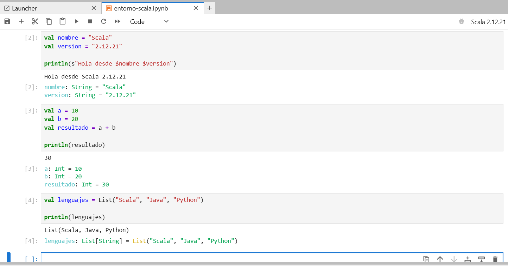

# Práctica 01 - Primeros pasos con Scala

## Entorno 1 — JupyterLab + Almond Kernel + Scala 2.12.21

En este primer entorno se configura **JupyterLab** para trabajar de forma interactiva con **Scala 2.12.21** mediante el **Almond Kernel**.

### Instalación de JupyterLab

Para instalar JupyterLab utilicé Python mediante `pip`.

Una vez completada la instalación, inicié JupyterLab desde la terminal de Windows.

Al iniciar el entorno, JupyterLab se abre automáticamente mediante una dirección local en el navegador web.

En mi caso, accedo a JupyterLab utilizando **Google Chrome**, desde donde puedo crear y ejecutar notebooks mediante su interfaz gráfica.

### Instalación de Almond Kernel

Para poder ejecutar código Scala dentro de JupyterLab instalé **Almond Kernel** utilizando **Coursier** desde PowerShell.

Una vez completada la instalación, Scala quedó disponible como kernel dentro de JupyterLab.

Al crear un nuevo Notebook, se puede seleccionar **Scala 2.12.21** como kernel.

### Verificación de la versión de Scala

Después de crear el Notebook utilizando Almond, comprobé la versión de Scala utilizada por el entorno.

El resultado confirma que el Notebook está ejecutándose con **Scala 2.12.21**.

### Pruebas con el entorno

Para comprobar el correcto funcionamiento del entorno realicé las tres pruebas propuestas en la práctica.

La primera prueba utiliza variables e interpolación de cadenas.

La segunda realiza una operación numérica utilizando dos valores.

La tercera crea una colección sencilla utilizando una lista de lenguajes.

Las tres pruebas se ejecutaron correctamente dentro del Notebook utilizando Scala 2.12.21.

### Notebook

El Notebook utilizado durante la práctica se encuentra disponible en formato `.ipynb` dentro de la carpeta correspondiente del repositorio.

[Ver Notebook de Scala](notebook/entorno-scala.ipynb)
