# Práctica 01 - Primeros pasos con Scala

## Entorno 1 — JupyterLab + Almond Kernel + Scala 2.12.21

En este primer entorno se configura **JupyterLab** para trabajar de forma interactiva con **Scala 2.12.21** mediante el **Almond Kernel**.

### Instalación de JupyterLab

Para instalar JupyterLab utilicé Python mediante `pip`.

Una vez completada la instalación, inicié JupyterLab desde la terminal de Windows.

Al iniciar el entorno, JupyterLab se abre automáticamente mediante una dirección local en el navegador web.

En mi caso, accedo a JupyterLab utilizando **Google Chrome**, desde donde puedo crear y ejecutar notebooks mediante su interfaz gráfica.

### Instalación de Almond Kernel

Para poder ejecutar código Scala dentro de JupyterLab instalé **Almond Kernel** utilizando **Coursier** desde PowerShell.

Una vez completada la instalación, Scala quedó disponible como kernel dentro de JupyterLab.

Al crear un nuevo Notebook, se puede seleccionar **Scala 2.12.21** como kernel.

### Verificación de la versión de Scala

Después de crear el Notebook utilizando Almond, comprobé la versión de Scala utilizada por el entorno.

El resultado confirma que el Notebook está ejecutándose con **Scala 2.12.21**.

### Pruebas con el entorno

Para comprobar el correcto funcionamiento del entorno realicé las tres pruebas propuestas en la práctica.

La primera prueba utiliza variables e interpolación de cadenas.

La segunda realiza una operación numérica utilizando dos valores.

La tercera crea una colección sencilla utilizando una lista de lenguajes.

Las tres pruebas se ejecutaron correctamente dentro del Notebook utilizando Scala 2.12.21.

### Notebook

El Notebook utilizado durante la práctica se encuentra disponible en formato `.ipynb` dentro de la carpeta correspondiente del repositorio.

[Ver Notebook de Scala](notebook/entorno-scala.ipynb)

## Entorno 2 — Visual Studio Code + Metals + Scala 2.12.21 + JDK 17 + sbt

En este segundo entorno se prepara un proyecto Scala utilizando **Visual Studio Code**, **Metals**, **JDK 17**, **Scala 2.12.21** y **sbt**.

### Instalación de JDK 17

Se instaló **JDK 17** como entorno de ejecución y compilación de Java necesario para trabajar con Scala y sbt.

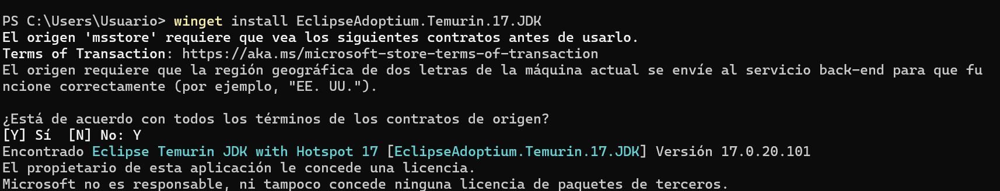

A continuación, se comprobó correctamente la versión instalada de Java y del compilador `javac`.

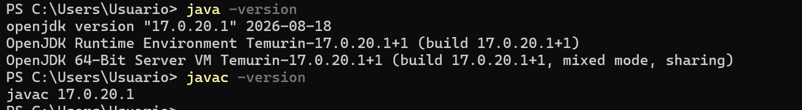

### Visual Studio Code

Para trabajar con el proyecto se utilizó **Visual Studio Code** como editor principal.

La siguiente imagen muestra la pantalla principal del programa.

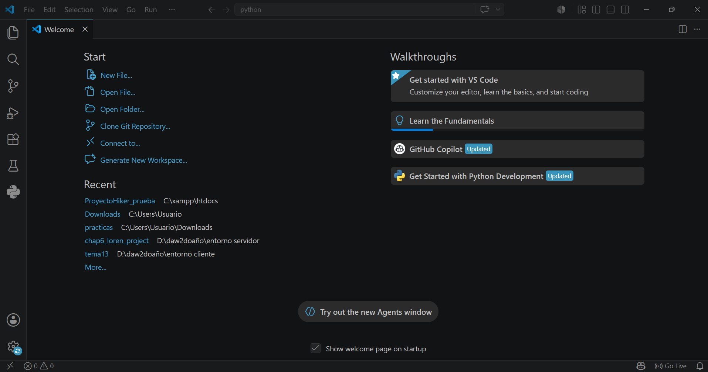

También se comprobó la versión instalada desde la opción **Help → About**.

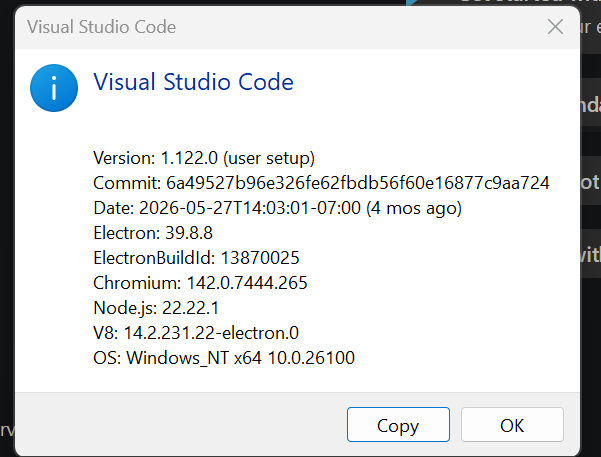

### Instalación de Metals

Desde el apartado de extensiones de Visual Studio Code se buscó la extensión **Scala (Metals)**.

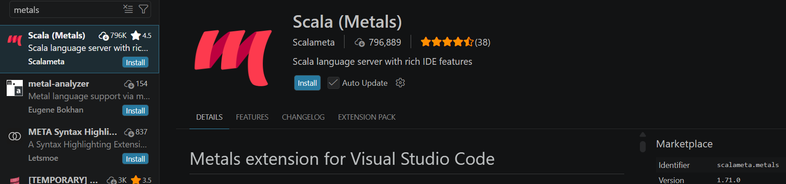

Después de instalarla, Metals quedó disponible dentro de Visual Studio Code para trabajar con proyectos Scala.

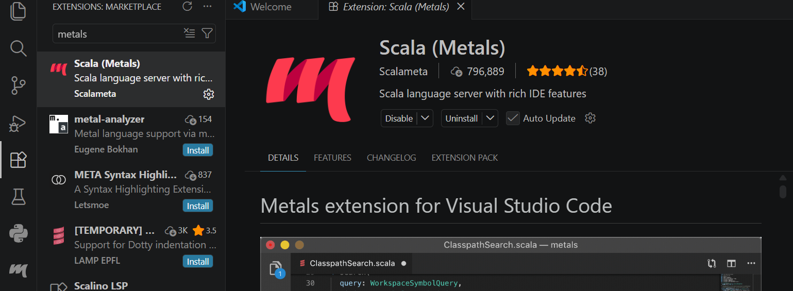

### Instalación de sbt

Se instaló **sbt** utilizando su instalador para Windows.

Una vez finalizada la instalación, se comprobó desde PowerShell que el comando estaba disponible y que la herramienta se había instalado correctamente.

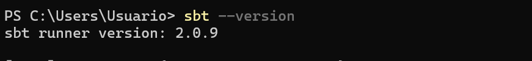

### Configuración del proyecto

En el archivo `build.sbt` se configuró explícitamente el proyecto para utilizar **Scala 2.12.21**.

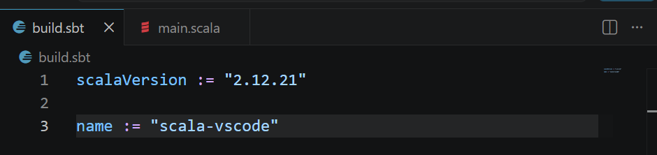

La estructura del proyecto quedó organizada con el archivo `build.sbt`, la carpeta `project` y el código fuente dentro de `src/main/scala`.

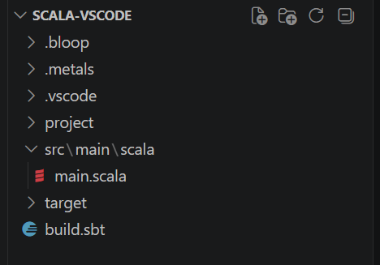

Dentro de `Main.scala` se creó el programa principal utilizado para comprobar el funcionamiento del entorno.

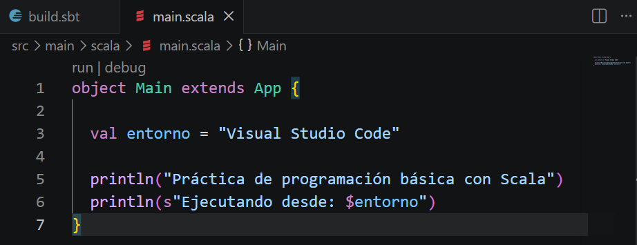

### Reconocimiento del proyecto con Metals

Al abrir la carpeta del proyecto, Metals detectó correctamente la configuración de sbt y reconoció el proyecto como un proyecto Scala.

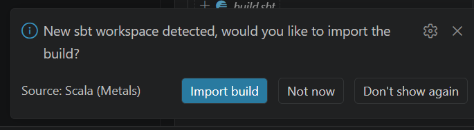

### Compilación y ejecución

El proyecto se compiló correctamente utilizando sbt desde la terminal integrada de Visual Studio Code.

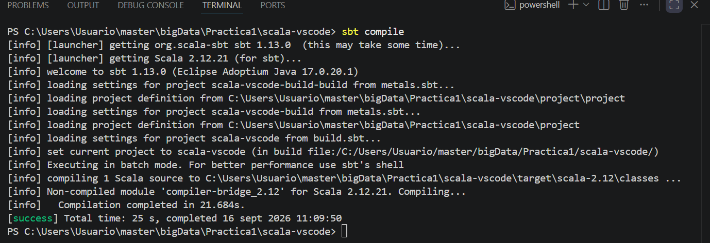

Finalmente, se ejecutó el programa y se comprobó que la salida se mostraba correctamente en la terminal.

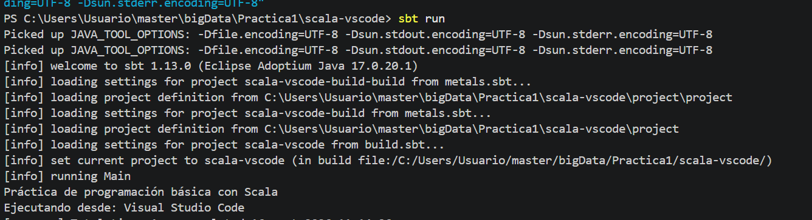

## Entorno 3 — IntelliJ IDEA Community + Scala 2.12.21 + sbt

En este tercer entorno se prepara un proyecto Scala utilizando **IntelliJ IDEA Community Edition**, **Scala Plugin**, **JDK 17**, **Scala 2.12.21** y **sbt**.

### Instalación de IntelliJ IDEA

Se descargó e instaló **IntelliJ IDEA Community Edition** utilizando su instalador para Windows.

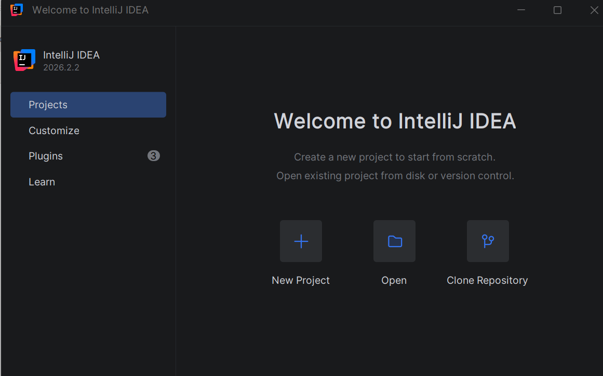

Una vez instalado, se comprobó la versión disponible desde el propio programa.

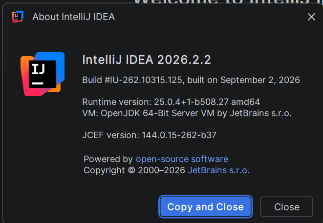

### Instalación del plugin de Scala

Desde el apartado de plugins de IntelliJ se buscó la extensión necesaria para añadir soporte para Scala.

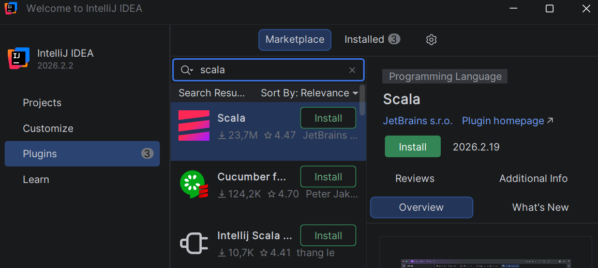

Posteriormente, se instaló el plugin para poder trabajar con proyectos Scala dentro del IDE.

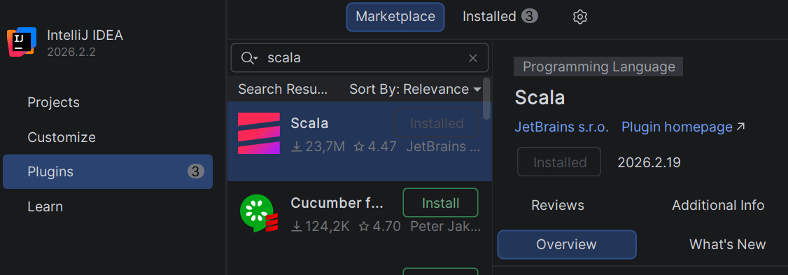

### Configuración de JDK 17

Durante la creación del proyecto `scala_intellij` se seleccionó **JDK 17** como versión de Java para el proyecto.

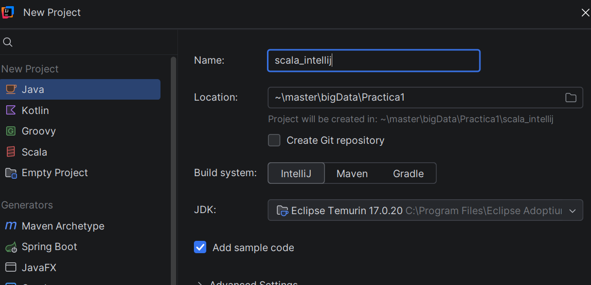

### Configuración del proyecto sbt

Dentro del proyecto se utilizó un archivo `build.sbt` para definir la configuración principal.

En este archivo se configuró explícitamente **Scala 2.12.21** y el nombre del proyecto.

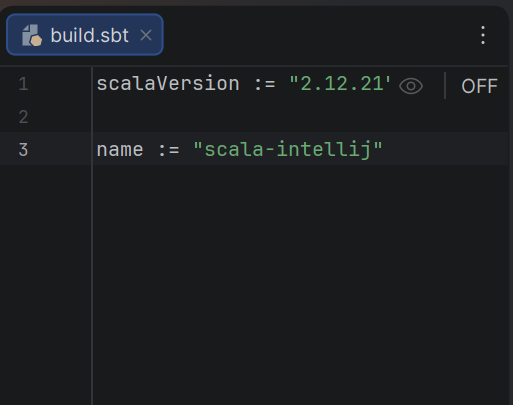

Al detectar el archivo `build.sbt`, IntelliJ solicitó cargar y construir la configuración del proyecto sbt.

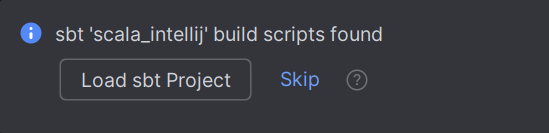

Después de aceptar la importación, IntelliJ construyó automáticamente la estructura del proyecto.

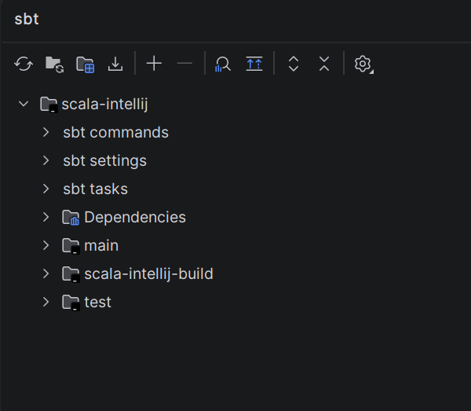

### Estructura del proyecto

Una vez completada la importación, la estructura del proyecto quedó organizada con el archivo `build.sbt`, la carpeta `project` y el código fuente dentro de `src/main/scala`.

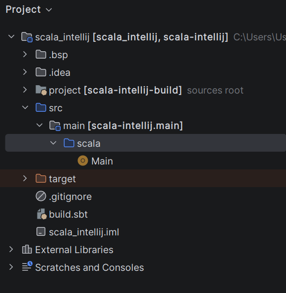

Dentro de `Main.scala` se creó el programa utilizado para comprobar el funcionamiento del entorno.

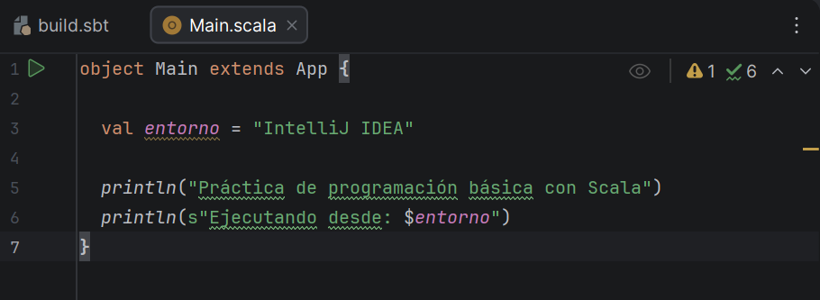

### Ejecución desde IntelliJ IDEA

El programa se ejecutó utilizando el botón de ejecución integrado de IntelliJ IDEA.

La consola del IDE mostró correctamente la salida del programa.

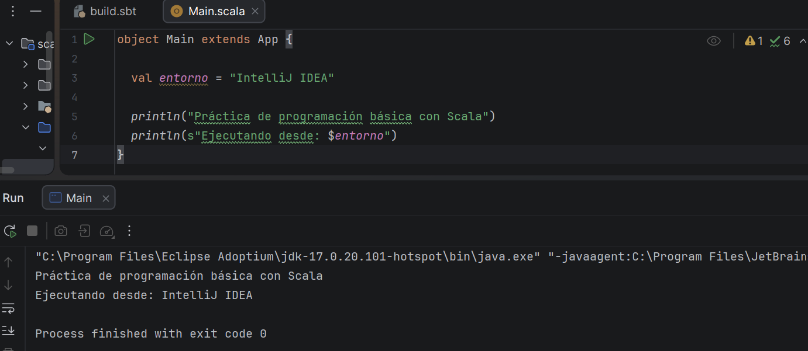

### Compilación y ejecución con sbt

Además de ejecutarlo desde el propio IDE, se comprobó también el funcionamiento del proyecto utilizando **sbt** desde la terminal.

Primero se realizó la compilación del proyecto.

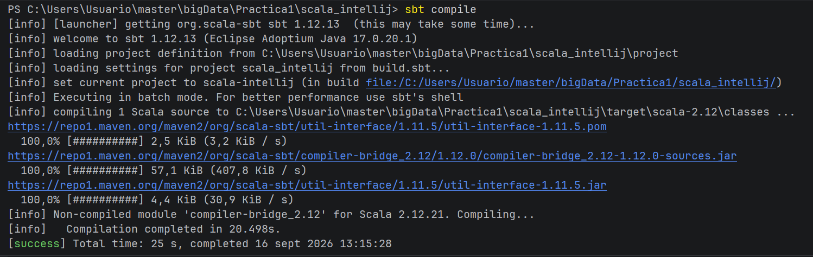

Posteriormente se ejecutó el programa utilizando sbt y se comprobó correctamente la salida.

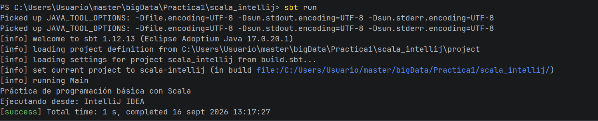

### Configuración de UTF-8

Durante las pruebas realizadas tanto en **Visual Studio Code** como en **IntelliJ IDEA**, fue necesario configurar manualmente la codificación **UTF-8** en la terminal para que los caracteres especiales y los acentos se mostraran correctamente durante la ejecución con sbt.

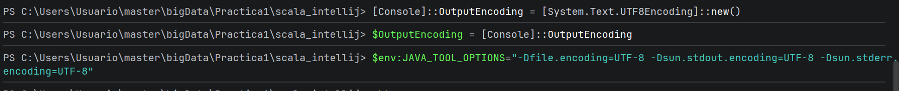 

