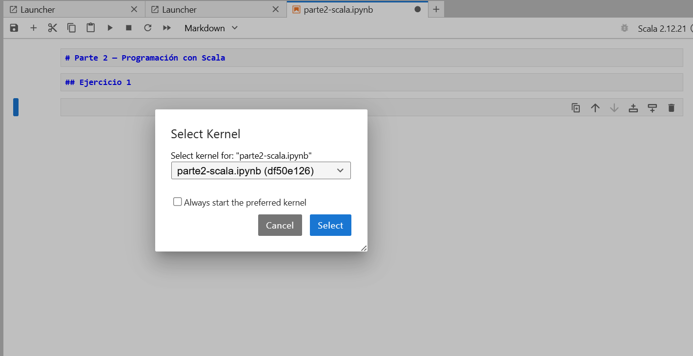
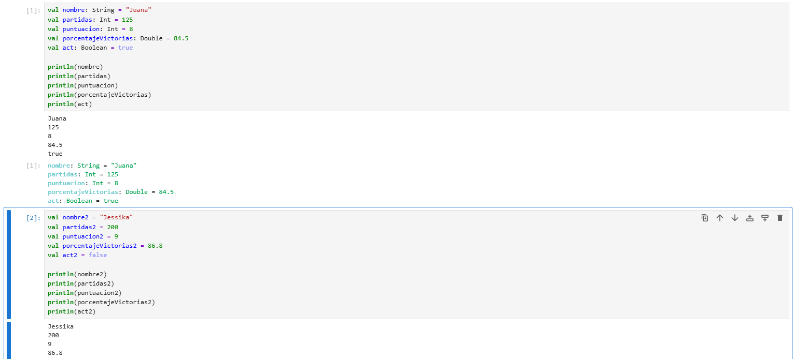
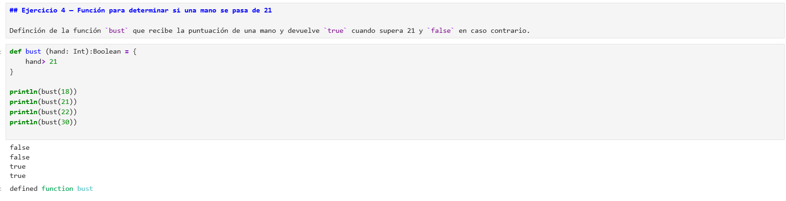
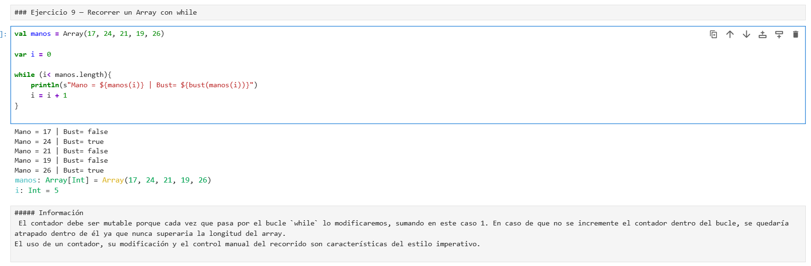
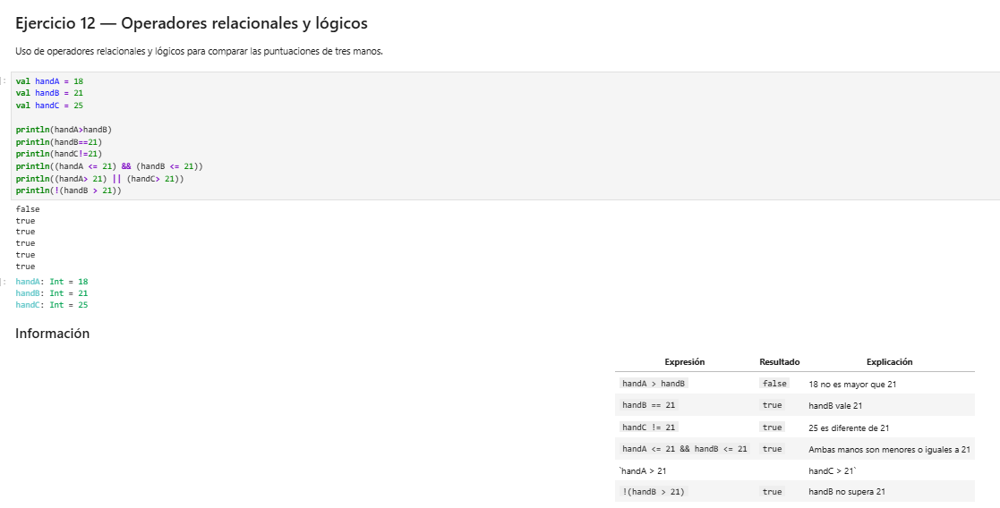
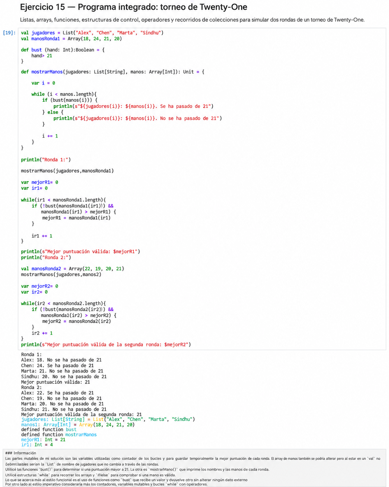

# Parte 2 — Programación con Scala

## Entorno utilizado

-JupyterLab
-Almond Kernel
-Scala 2.12.21

## Contenido

Esta parte contiene 15 ejercicios de programación realizados
en Scala utilizando JupyterLab.

## Notebook

[Ver Notebook de la Parte 2](notebook/parte2-scala.ipynb)

## Evidencias
Version de Scala en Jupyter Lab

## Algunos ejercicios
Ejercicio 1

Ejercicio 4

Ejercicio 9

Ejercicio 12

Ejercicio 15

