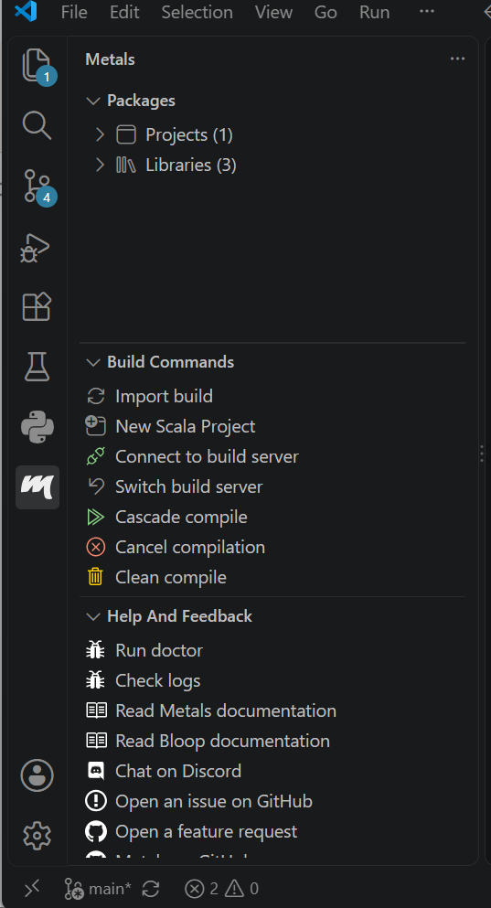
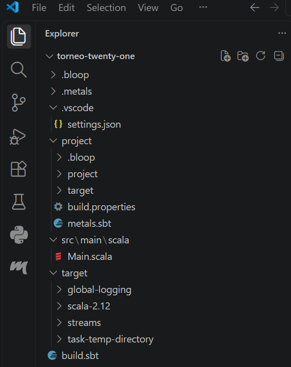
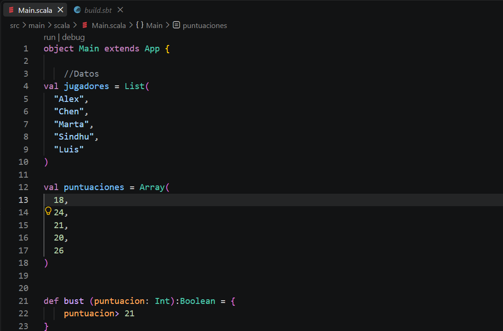
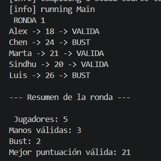
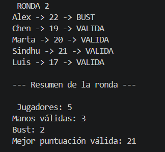
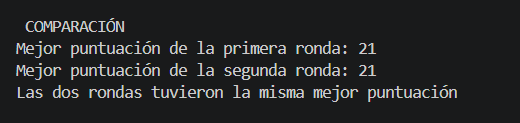
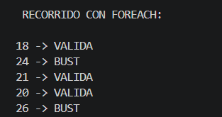
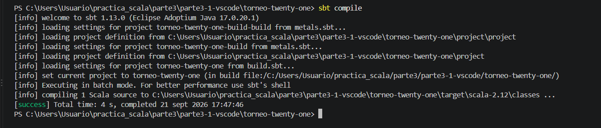
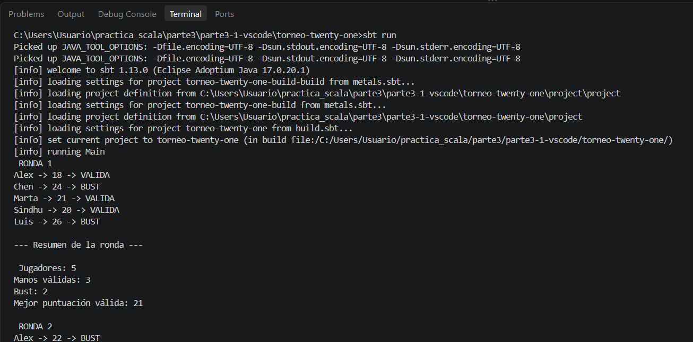
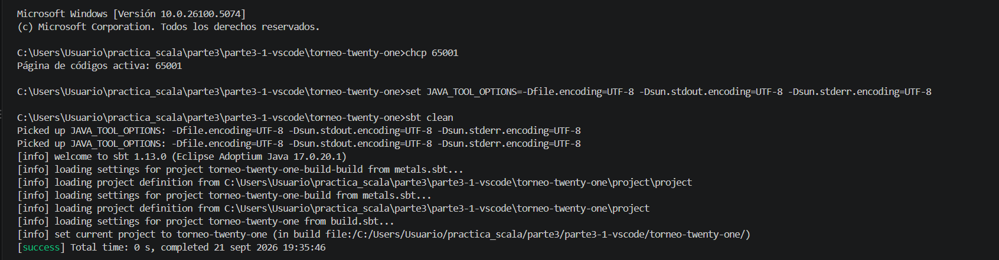

# Mini proyecto 3.1 — Torneo de Twenty-One

## Entorno

- Visual Studio Code
- Metals
- Scala 2.12.21
- JDK 17
- sbt

Confirmación del IDE

## Descripción

Este mini proyecto consiste en una aplicación desarrollada en Scala que analiza los resultados de dos rondas de un torneo de Twenty-One.

El programa determina si cada jugador dispone de una mano válida o si supera los 21 puntos, además de calcular diferentes estadísticas de cada ronda.

## Estructura

El proyecto utiliza una estructura sbt:

El archivo `build.sbt` contiene la configuración del proyecto y la versión de Scala utilizada.

El archivo `Main.scala` contiene los datos, funciones y lógica principal de la aplicación.

## Colecciones utilizadas

Los nombres de los jugadores se almacenan utilizando una `List`.
Las puntuaciones se almacenan utilizando objetos `Array[Int]`.

Ni la lista de jugadores ni puntuaciones se modifican durante la ejecución del mini programa.

## Funciones utilizadas

### `bust`

Recibe una puntuación y devuelve `true` cuando supera 21 y `false` en caso contrario.

### `estadoMano`

Utiliza la función `bust` para devolver `VALIDA` o `BUST`.

### `mejorMano`

Compara dos puntuaciones y devuelve la mejor puntuación válida.

### `mostrarManos`

Recorre las puntuaciones utilizando un bucle `while` y muestra el jugador, su puntuación y el estado de la mano.

### `contarValidas`

Cuenta el número de jugadores que no superan 21.

### `contarBust`

Cuenta el número de jugadores que superan 21.

### `mejorPuntuacion`

Recorre las puntuaciones y determina cuál es la mayor puntuación válida.

## Primera ronda

En la primera ronda se obtienen los siguientes resultados:

- Jugadores: 5
- Manos válidas: 3
- Bust: 2
- Mejor puntuación válida: 21

## Segunda ronda

En la segunda ronda:

- Jugadores: 5
- Manos válidas: 4
- Bust: 1
- Mejor puntuación válida: 21

## Comparación de rondas

La mejor puntuación de ambas rondas es 21, por lo que las dos rondas obtienen la misma mejor puntuación.

## `while` y `foreach`

La primera versión utiliza `while` para recorrer las puntuaciones, necesitando un contador mutable que permita controlar la posición del array.

También se realizó una segunda versión utilizando `foreach`, que permite procesar directamente cada elemento de la colección sin controlar un índice, por lo que se aproxima más al estilo funcional.

## Ejecución

El proyecto se compila mediante:

` sbt compile `

Posteriormente se ejecuta mediante:

` sbt run `

## Problemas encontrados

Durante la ejecución desde la terminal fue necesario configurar correctamente la codificación UTF-8 para que los caracteres especiales y los acentos se mostraran correctamente.

