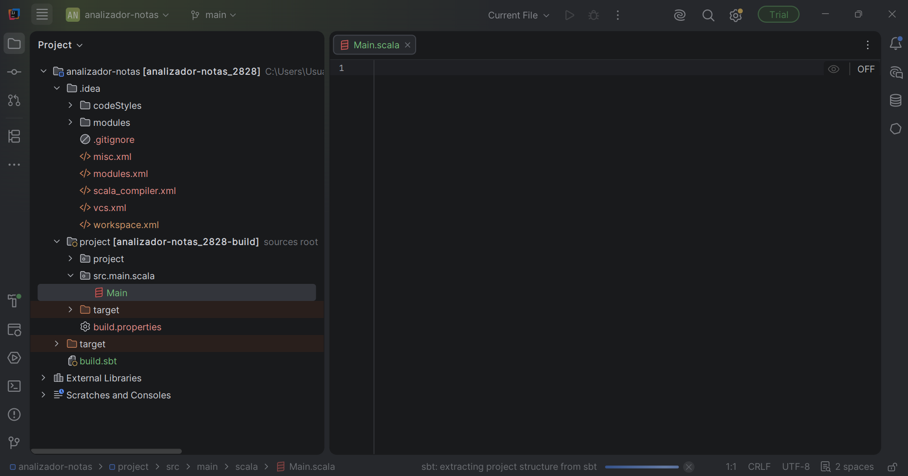
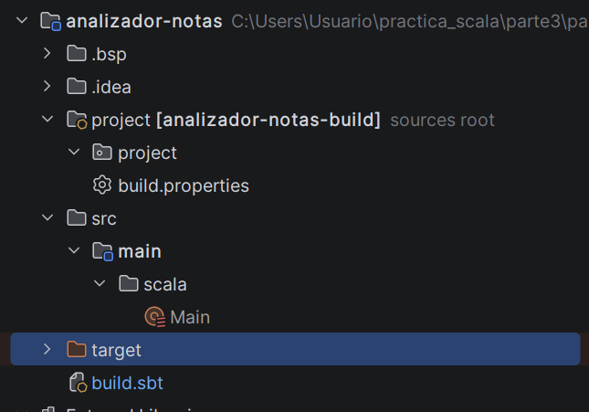
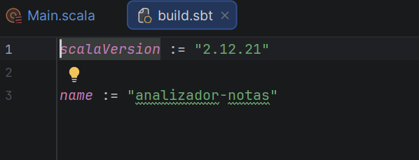
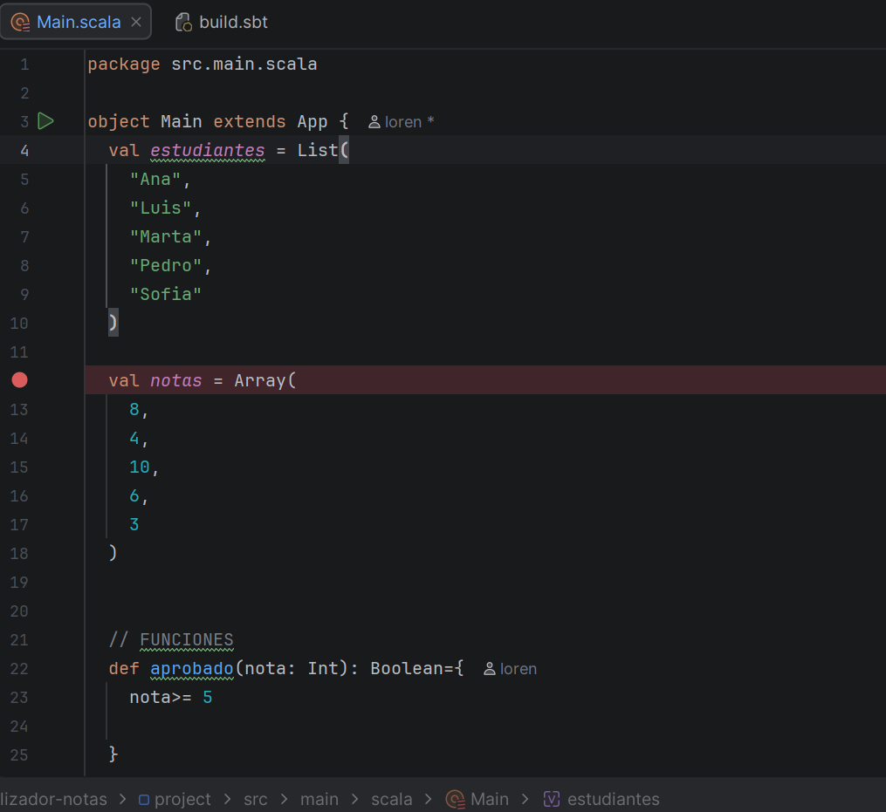
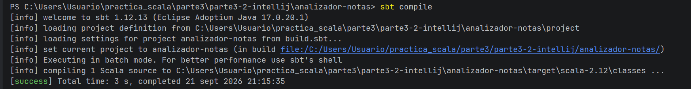
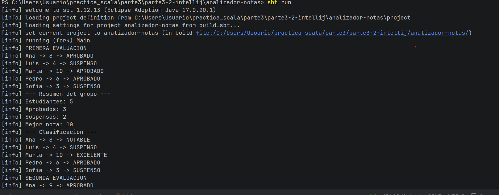
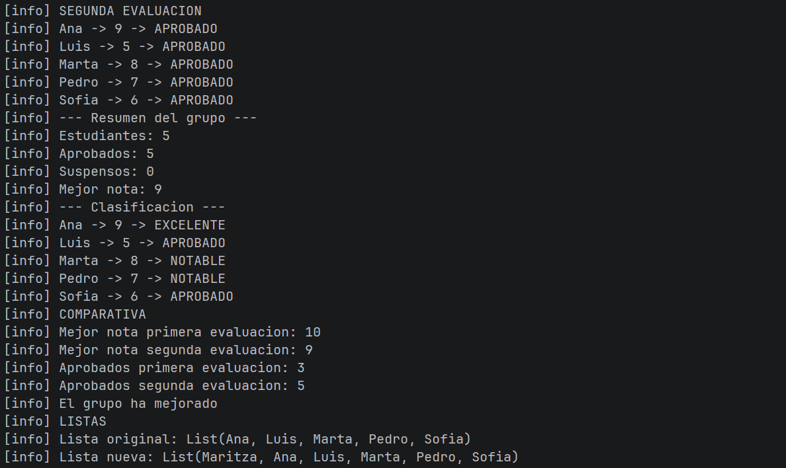

# Mini proyecto 3.2 — Analizador de calificaciones

## Entorno

- IntelliJ IDEA Community
- Scala 2.12.21
- JDK 17
- sbt

  Comprobamos el entorno
  

Plugin de Scala activo
  

## Descripción

Este mini proyecto consiste en una aplicación Scala que analiza las calificaciones de un grupo de estudiantes.

El programa determina qué estudiantes aprueban o suspenden, calcula estadísticas básicas, clasifica las notas y compara los resultados de dos evaluaciones.

## Estructura

El archivo `build.sbt` contiene la configuración de Scala utilizada por el proyecto.

`Main.scala` contiene las colecciones, funciones y lógica principal del programa.

## Colecciones utilizadas

Los nombres de los estudiantes se almacenan en una `List`.

Las notas de cada evaluación se almacenan utilizando `Array[Int]`.

## Funciones utilizadas

### `aprobado`

Comprueba si una nota es mayor o igual que 5.

### `estadoNota`

Devuelve `APROBADO` o `SUSPENSO` dependiendo de la nota.

### `maxNota`

Compara dos notas y devuelve la mayor.

### `clasificacion`

Clasifica cada nota como `EXCELENTE`, `NOTABLE`, `APROBADO` o `SUSPENSO`.

### `mostrarNotas`

Recorre las notas utilizando un bucle `while` y muestra los resultados de cada estudiante.

### `contarAprobados`

Calcula el número de estudiantes aprobados.

### `mejorNota`

Obtiene la nota más alta de una evaluación.

## Primera evaluación

Los resultados obtenidos son:

- Estudiantes: 5
- Aprobados: 3
- Suspensos: 2
- Mejor nota: 10

  

## Segunda evaluación

Los resultados obtenidos son:

- Estudiantes: 5
- Aprobados: 5
- Suspensos: 0
- Mejor nota: 9

## Comparación

La primera evaluación tiene 3 estudiantes aprobados y la segunda evaluación tiene 5.

Como el número de aprobados ha aumentado, se considera que el grupo ha mejorado.

## Uso de listas

Se creó una nueva lista utilizando el operador `::`:

`val nuevosEstudiantes = "Carlos" :: estudiantes`

Esta operación crea una nueva lista y mantiene sin cambios la lista original, ya que `List` es una colección inmutable.

## Ejecución

El proyecto se compila utilizando:

` sbt compile `

Posteriormente se ejecuta utilizando:

` sbt run `

